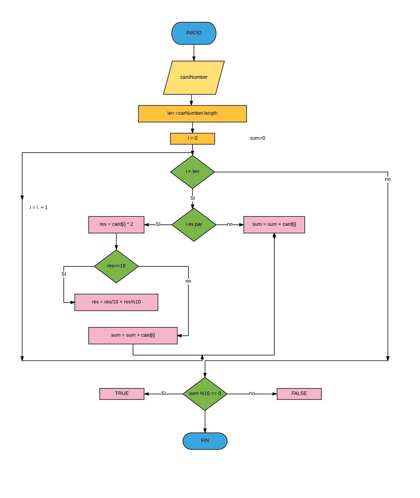

 **Pseudocodigo** 
 ============
 **Inicio**   
 ---------
 >### Ingresar cardNumber. ###  
 >### Leer variable **len** es igual a **cardNumber.length**. ###  
 
 >### *i*=0 *sum*=0 *res*=0 ###

>### Si  *i* < **len** Entonces *i* es par. ###  

>### Si *i* es par Entonces __res = card [ *i* ] * 2__ ###  
>### De lo contrario **sum = sum + card [i]** ###   

>### Si **res > = 10** Entonces __res = res/10 + res%10__ ###  
>### De lo contrario __sum = sum + card[ *i* ]__ ###  

>### Pero Si *i* no es par Entonces __sum % 10 == 0__ ###  
>### Si __sum % 10 == 0__ Entonces es *TRUE* ###  
>### De lo contrario es *FALSE* ###  

**FIN**
-------
 